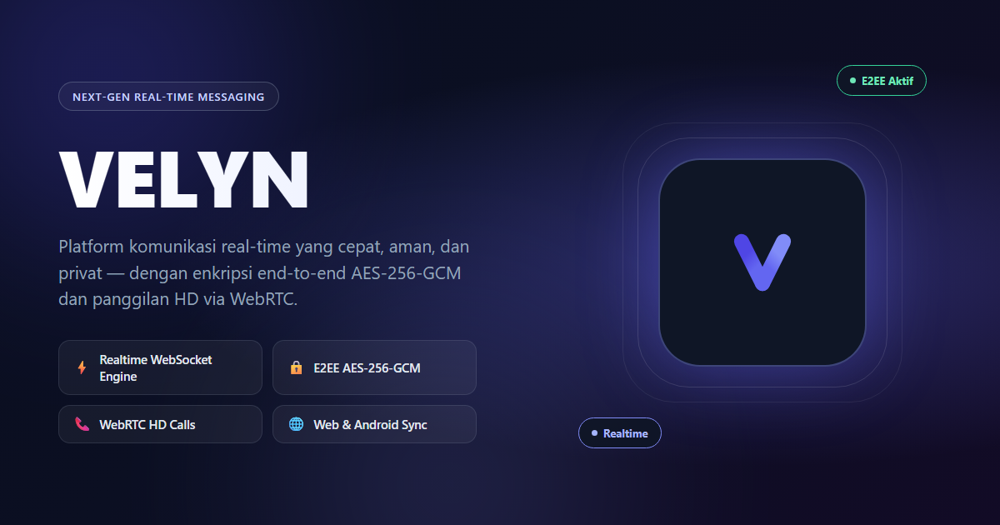

# VELYN

### Ngobrol cepat, aman, dan privat — di mana aja, kapan aja.

Aplikasi pesan & panggilan real-time yang dibangun dari nol dengan satu prinsip: **isi obrolan kamu adalah urusan kamu, titik.** Setiap pesan dienkripsi langsung di perangkat kamu sebelum dikirim, jadi bukan cuma "aman di jalan" — tapi memang nggak pernah bisa dibaca siapa pun selain kamu dan lawan bicara. Nggak server, nggak penyedia layanan, nggak pihak ketiga.

---

## ✨ Kenapa Orang Betah Pakai VELYN

- **💬 Chat yang beneran instan** — nggak ada delay aneh, status "terkirim" dan "dibaca" muncul real-time, ketikan lawan bicara kelihatan langsung lewat indikator "sedang mengetik".
- **🔒 Terenkripsi end-to-end (AES-256-GCM)** — enkripsi dihitung di HP/browser kamu sendiri pakai Web Crypto API, bukan di server. Server cuma nerusin data yang udah terkunci, dia sendiri nggak punya kuncinya.
- **📞 Panggilan suara & video HD** — koneksi WebRTC langsung antar perangkat (peer-to-peer), jadi kualitasnya jernih dan nggak nge-lag kalau jaringan lagi bagus. Server nggak pernah "dengar" atau "lihat" panggilan kamu — dia cuma bantu dua perangkat saling kenalan di awal.
- **🔗 Login lintas perangkat via QR** — mau lanjut chat dari HP ke laptop? Scan QR, langsung sinkron, sama kayak yang biasa kamu pakai di aplikasi chat populer lainnya.
- **🌐 Jalan di mana aja, tanpa app store** — buka langsung dari browser (Chrome, Safari, Edge, Firefox), atau install jadi aplikasi dengan sekali klik ("Add to Home Screen" / "Install App") buat pengalaman yang berasa kayak aplikasi native — di HP maupun di komputer.
- **🗑️ Kontrol penuh atas data kamu** — atur auto-delete pesan, atau hapus akun beserta seluruh riwayatnya kapan pun kamu mau. Nggak ada data yang "nyangkut" di server selamanya.
- **🚫 Tanpa iklan, tanpa pelacak, tanpa jual data** — nggak ada model bisnis "kalau gratis, kamu produknya" di sini. Titik.

---

## 🔐 Soal Keamanan, Kita Serius

Banyak aplikasi chat bilang "terenkripsi", tapi enkripsinya baru jalan pas data "dalam perjalanan" (in-transit) — begitu sampai di server, isinya kebaca lagi. VELYN beda: pesan kamu **sudah** jadi kode acak (ciphertext) SEBELUM meninggalkan perangkat kamu. Formatnya `velyn:v1:<iv>:<ciphertext>` — server, database, bahkan tim VELYN sendiri cuma lihat gibberish, bukan isi obrolan.

Itu juga kenapa fitur pencarian pesan di server, backup otomatis ke cloud yang bisa dibaca pihak lain, atau moderasi konten otomatis itu **secara desain nggak mungkin ada** di VELYN — bukan karena belum sempat dibikin, tapi karena kalau ada, artinya enkripsinya bohongan.

---

## 📦 Download & Instalasi

Buka halaman **[Releases](https://github.com/theepar/velyn-release/releases/latest)** untuk versi terbaru.

### 🌐 Web (rekomendasi — paling gampang)
1. Buka **[www.velynchat.web.id](https://www.velynchat.web.id/)** di browser apa saja.
2. Langsung bisa dipakai — nggak perlu install apa-apa.
3. Mau lebih "berasa app"? Klik **Install** / **Add to Home Screen** di menu browser. Ikon VELYN bakal muncul di homescreen/desktop kamu, buka-nya secepat aplikasi native.

### 🤖 Android
1. Download `velyn-mobile-vX.X.X.apk` dari halaman [Releases](https://github.com/theepar/velyn-release/releases/latest).
2. Aktifkan **"Install from unknown sources"** di Settings → Security (cuma sekali, buat instalasi file APK di luar Play Store).
3. Buka file APK yang udah didownload, ikuti proses instalasi seperti biasa.

---

## ❓ Pertanyaan yang Sering Ditanya

**Apakah VELYN gratis?**
Ya, sepenuhnya gratis, tanpa biaya langganan atau paket premium tersembunyi.

**Apakah saya wajib install aplikasi?**
Enggak. Versi web-nya sudah lengkap fiturnya — install itu opsional, cuma buat kenyamanan (ikon di homescreen, buka lebih cepat).

**Kalau saya ganti HP, riwayat chat-nya hilang nggak?**
Selama kamu belum hapus akun atau matiin auto-delete, riwayat tersinkron ke akun kamu (tetap dalam bentuk terenkripsi) dan bisa diakses lagi setelah login di perangkat baru.

**Apakah tim VELYN bisa baca chat saya kalau ada laporan/komplain?**
Tidak bisa. Karena enkripsinya di sisi klien, server (dan siapa pun yang mengelolanya) secara teknis tidak memiliki cara untuk membaca isi pesan.

---

**Coba sekarang, rasain sendiri bedanya ngobrol tanpa was-was.**

---

> Source code bersifat proprietary dan tidak dipublikasikan.

  &copy; 2026 VELYN Team

